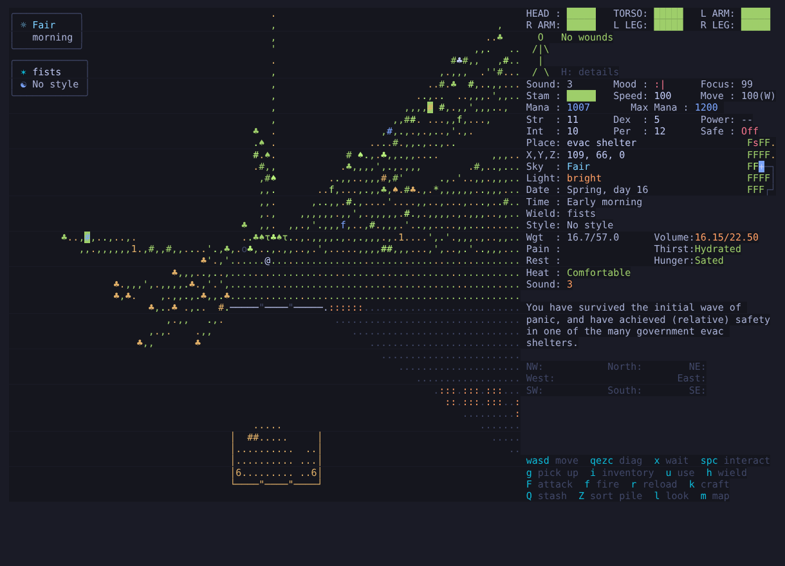
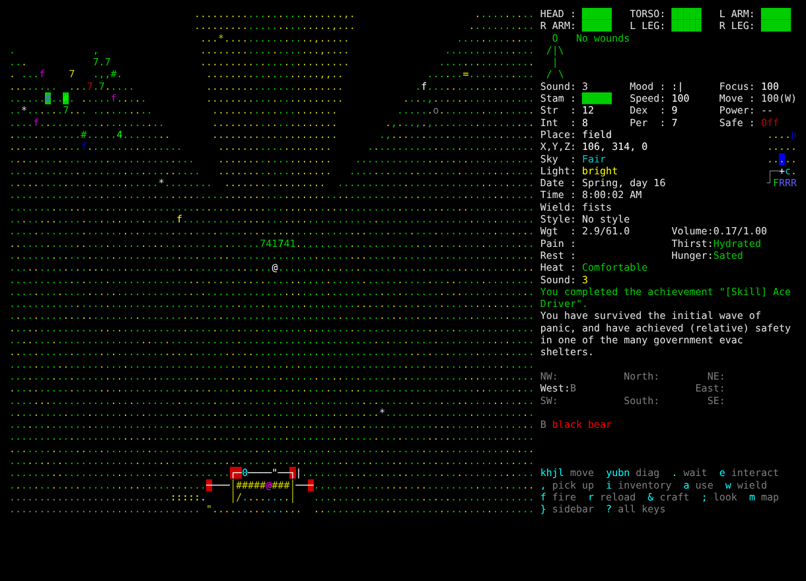
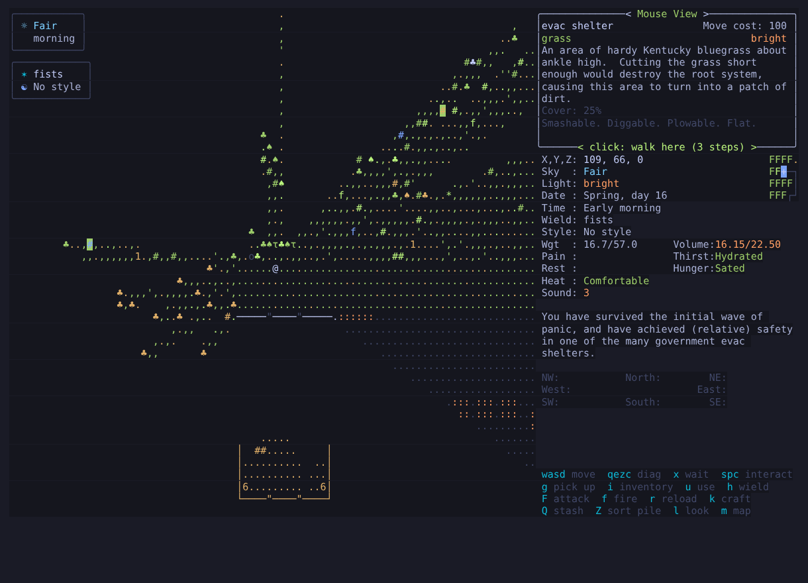
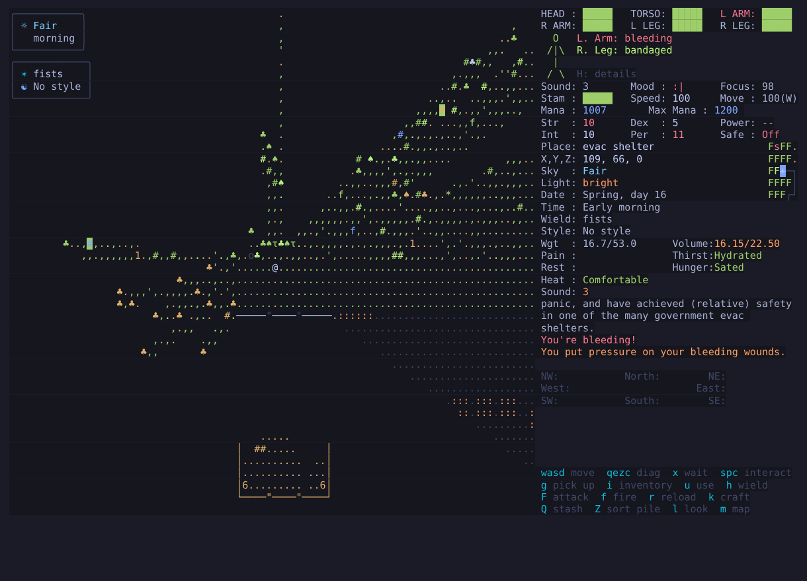
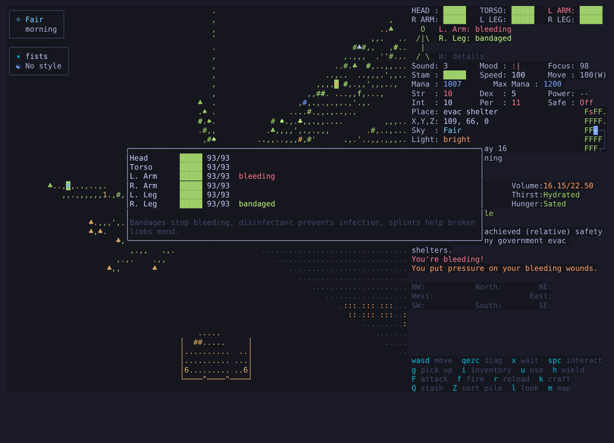
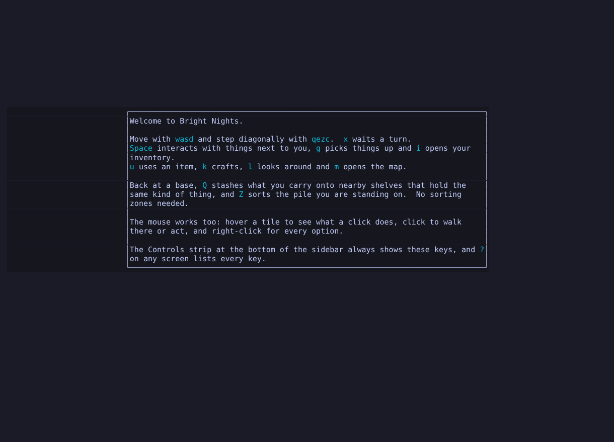
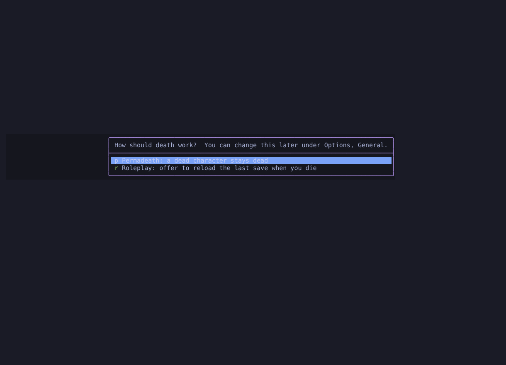
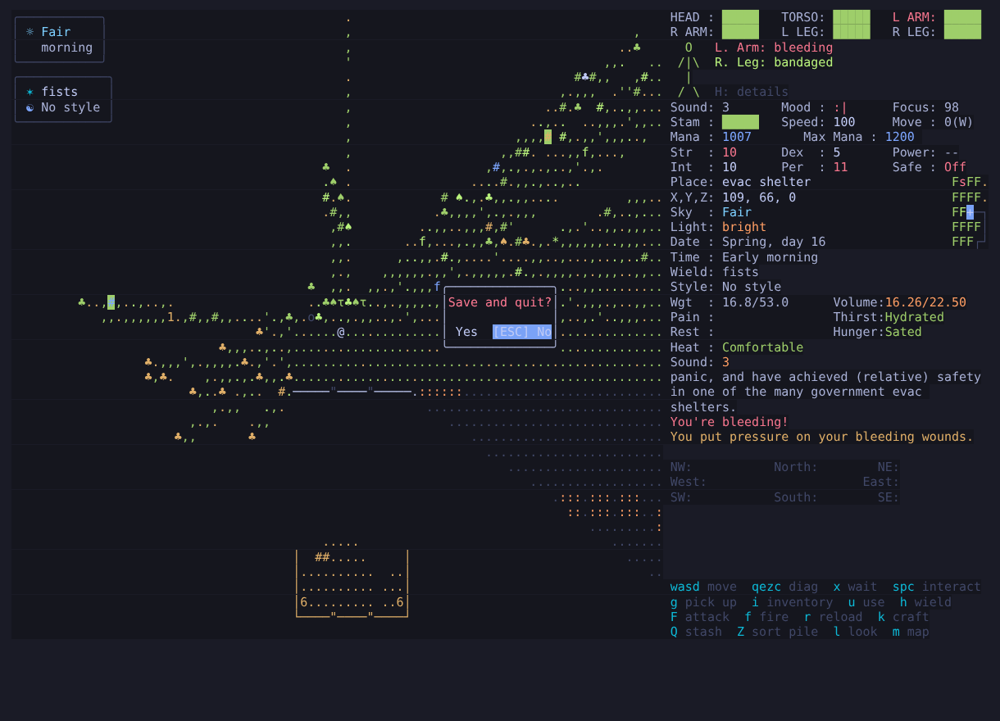
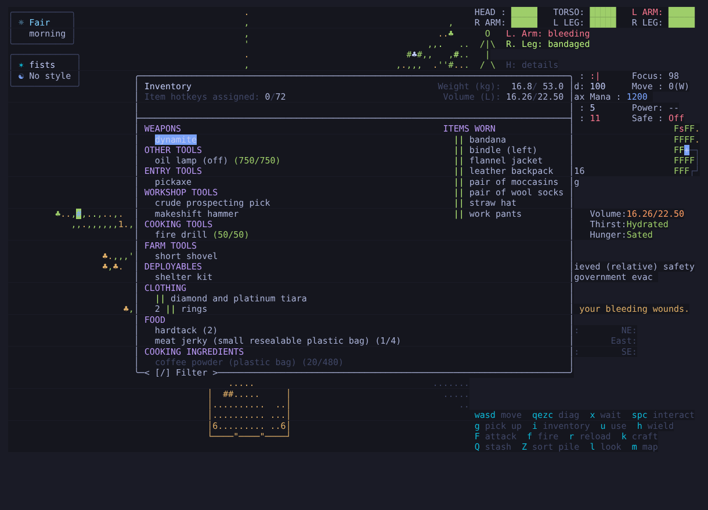
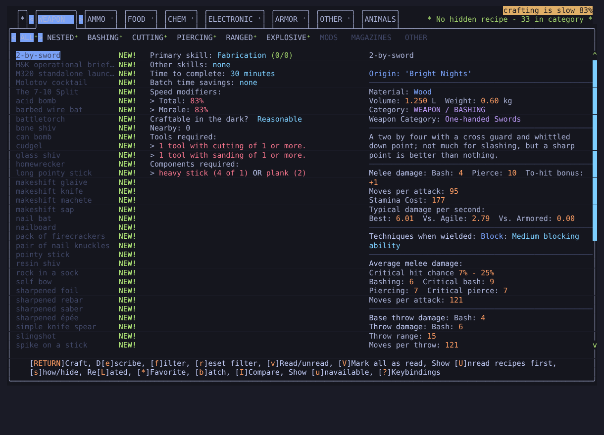

# Visual changes

Screens captured from the terminal build (132×42, Tokyo Night palette) by
`tests/e2e`'s tmux harness, so they show the real game, not mock-ups. `OVERHAUL.md` explains
each feature; `CHANGELOG-OVERHAUL.md` lists them by date.

## In game

- Top left: the **weather box** (icon, weather, time) and the **weapon box** (weapon, fighting style).
- Sidebar: the **body panel** (a figure coloured by limb health, wounds beside it) and the
  **Controls strip** with the live key for each common action.
- Map: **readable glyphs**. Trees are ♣, pines ♠ and saplings τ instead of 7, 4 and 1.
- Rounded window corners.

For comparison, the same kind of start with the classic control scheme, classic colours, digit
glyphs and the map boxes turned off. The fork's sidebar panels stay; each can be hidden from the
sidebar options.

## Mouse tile selection

Hovering a tile highlights it, previews the route and names the click action on the Mouse View
border ("click: walk here (2 steps)"). Left click does it; right click lists every option.

## Body panel and details

## First game

The welcome card lists the core keys with their live bindings, then asks how death works, like
Caves of Qud's Classic and Roleplay modes.

## Prompts and menus

Yes/No prompts are buttons that open on **No**; Enter or a click answers and Esc cancels.

Jewelry is one item per form. Different rings stack on one line, and each keeps its own gem,
metal, name and price.

The crafting menu opens on a tab that has recipes instead of an empty one.
